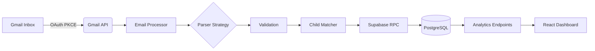

# TinySteps 

> **Seamless daycare intelligence for modern families** – turn fragmented daily‑report emails into a real‑time, analytics‑ready dashboard.

---

[](https://github.com/tinystepsapp/tinysteps/actions)
[](LICENSE)
[](https://vercel.com/import/project?template=tinystepsapp/tinysteps)

---

## 📋 Table of Contents

* [Overview](#-overview)
* [Features](#-features)
* [Quick Start](#-quick-start)
* [Project Structure](#-project-structure)
* [Architecture](#️-architecture)
* [Configuration](#-configuration)
* [API Reference](#-api-reference)
* [Database Schema](#-database-schema)
* [Testing](#-testing)
* [Deployment](#-deployment)
* [Roadmap](#-roadmap)
* [Contributing](#-contributing)
* [License](#-license)
* [Acknowledgments](#-acknowledgments)

---

## 🌟 Overview

**TinySteps** automatically ingests daycare daily‑report emails, reconciles them across providers, and surfaces rich analytics for parents & caregivers. Built on **Next.js 14**, **Supabase**, and **Google Cloud**, TinySteps transforms raw HTML emails into actionable insights.

---

## ✨ Features

| Category                            | Highlights                                                                                                                                                                              |
| ----------------------------------- | --------------------------------------------------------------------------------------------------------------------------------------------------------------------------------------- |
| **📧 Intelligent Email Processing** |  • Multi‑provider parsers (Tadpoles, Goddard Schools, Montessori, …)<br>• Smart fuzzy‑matching of child names<br>• Idempotent ingestion prevents duplicates                             |
| **📊 Analytics & Insights**         |  • Sleep trends & nap heat‑maps<br>• Meal frequency & nutrition breakdowns<br>• Activity timelines by domain (cognitive, physical, social)<br>• Unified photo gallery & download portal |
| **👨‍👩‍👧 Family‑Centric UX**      |  • Multi‑child dashboard<br>• Role‑based sharing for parents & caregivers<br>• Manual event logging for off‑grid moments                                                                |
| **🔒 Security & Privacy**           |  • Google OAuth via NextAuth.js<br>• Row‑level security (RLS) in Supabase<br>• Ownership checks on every call                                                                           |
| **🛠️ Developer Experience**        |  • Typed end‑to‑end with TypeScript & Supabase types<br>• Shadcn/ui component library<br>• Pino structured logging & Jest test suite                                                    |

---

## 🚀 Quick Start

### 1. Prerequisites

* **Node.js ≥ v18**
* **Supabase** project (free tier is fine)
* **Google Cloud** project with Gmail API & OAuth 2.0 credentials

### 2. Installation

```bash
# Clone & enter repository
$ git clone https://github.com/yourusername/tinysteps.git
$ cd tinysteps

# Install dependencies
$ pnpm install   # or yarn / npm install
```

### 3. Configuration

Copy env template and fill in values:

```bash
$ cp .env.example .env.local
```

```dotenv
NEXT_PUBLIC_SUPABASE_URL=🔗
NEXT_PUBLIC_SUPABASE_ANON_KEY=🔑
SUPABASE_SERVICE_ROLE_KEY=🔑🔑

NEXTAUTH_URL=http://localhost:3000
NEXTAUTH_SECRET=please-change-me

GOOGLE_CLIENT_ID=🆔
GOOGLE_CLIENT_SECRET=🔒

GMAIL_FETCH_MAX_MESSAGES=10
LOG_LEVEL=info
```

### 4. Database Migrations

```bash
# Push local SQL migrations to Supabase
$ npx supabase db push
```

### 5. Run in Development

```bash
$ pnpm dev   # or yarn dev / npm run dev
```

Visit **[http://localhost:3000](http://localhost:3000)** and sign in with Google OAuth to begin.

---

## 📁 Project Structure

```text
 tinysteps
 ├─ app/                    # Next.js 14 app router
 │  ├─ api/
 │  │  ├─ gmail/            # Gmail integration endpoints
 │  │  ├─ analytics/        # REST / RPC analytics layer
 │  │  └─ children/         # Child CRUD
 │  ├─ auth/                # Auth pages & callbacks
 │  ├─ settings/            # User / provider configuration
 │  └─ (routes)/            # UI routes
 ├─ components/
 │  ├─ ui/                  # shadcn/ui primitives
 │  └─ features/            # Domain components
 ├─ lib/
 │  ├─ gmail/               # Email ETL pipeline
 │  ├─ analytics/           # Data aggregation helpers
 │  ├─ supabase/            # Typed Supabase client
 │  └─ auth/                # NextAuth config
 ├─ supabase/               # SQL migrations & type‑gen
 ├─ public/                 # Static assets
 └─ tests/                  # Jest test suites
```

---

## 🏗️ Architecture

<details>
<summary>Mermaid diagram</summary>



</details>

### Tech Stack

| Layer         | Technology                       |
| ------------- | -------------------------------- |
| Front‑end     | Next.js 14, React 18, TypeScript |
| Styling       | Tailwind CSS, shadcn/ui          |
| Back‑end      | Next.js API Routes               |
| Data          | Supabase (PostgreSQL + Storage)  |
| AuthN/Z       | NextAuth.js + Google OAuth       |
| Email ETL     | Gmail API, Cheerio HTML parser   |
| Observability | Pino logger, Logflare            |
| Testing       | Jest, @testing‑library/react     |

---

## 🔧 Configuration

### Adding a New Daycare Provider

1. **Settings → Providers → Add Provider**
2. Fill in:

   * **Provider Name** – e.g. *“Bright Horizons – Main St.”*
   * **Sender Email** – exact *from* address
   * **Parser Strategy** – choose or leave *Auto*.
3. Save & authorize Gmail if prompted.

| Strategy           | Description                         | Email Pattern               |
| ------------------ | ----------------------------------- | --------------------------- |
| `tadpoles_v1`      | Standard Tadpoles HTML email        | \*@tadpoles.com             |
| `goddard_tadpoles` | Goddard Schools via Tadpoles        | \*@tadpoles.com + “Goddard” |
| `montessori_v1`    | Direct Montessori daily log         | Varies                      |
| `custom_regex`     | Bring‑your‑own regex for edge cases | User‑defined                |

---

## 📚 API Reference

```ts
/** Gmail Integration */
GET  /api/gmail/fetch         // → { processedCount: number, errors: string[] }

/** Analytics */
GET  /api/analytics/sleep?childId={id}&start={ISO}&end={ISO}
GET  /api/analytics/meals?childId={id}&start={ISO}&end={ISO}
GET  /api/analytics/activities?childId={id}&start={ISO}&end={ISO}
GET  /api/analytics/photos?childId={id}&limit=50&offset=0

/** Manual Logging */
POST /api/log
// body: { type: 'nap' | 'meal' | 'bathroom' | 'activity'; childId: string; timestamp: string; meta?: Record<string, any> }
```

Full OpenAPI spec is published at **`/api/openapi.json`** (live once the dev server is running).

---

## 🗄️ Database Schema

| Table                                            | Description                     |
| ------------------------------------------------ | ------------------------------- |
| `children`                                       | Child profiles & metadata       |
| `daily_reports`                                  | Raw parsed daycare emails       |
| `naps`, `meals`, `bathroom_events`, `activities` | Normalised event tables         |
| `photos`                                         | Image blobs & meta              |
| `user_daycare_providers`                         | Provider configuration per user |

Supabase automatically generates typed client libraries from the schema – see `lib/supabase/types.ts`.

---

## 🧪 Testing

```bash
# Run all Jest suites
$ pnpm test

# Watch mode
$ pnpm test --watch

# Coverage report (HTML & text‑summary)
$ pnpm test --coverage
```

---

## 🚢 Deployment

### Vercel (one‑click)

1. Push the repo to GitHub.
2. **Import** into Vercel → *New Project*.
3. Set environment variables.
4. Deploy – Vercel will handle previews, PR comments, and production.

#### Production Checklist

* [ ] `NODE_ENV=production`
* [ ] Dedicated Supabase project (Prod)
* [ ] Google OAuth production redirect URIs
* [ ] Supabase RLS enforced & tested
* [ ] Gmail API quota guardrails
* [ ] Observability (Logflare / Datadog) set up

---

## 📈 Roadmap

* 📱 **Mobile App** – React Native companion
* 🔔 **Real‑Time Push** – live updates via Supabase Realtime
* 🧠 **Advanced Analytics** – ML‑powered developmental insights
* 🛒 **Provider Marketplace** – community‑built parsers
* 📤 **Exports** – PDF daily reports, CSV downloads
* 🔗 **Webhooks & Integrations** – Zapier, IFTTT, etc.
* 🗣️ **Voice Assistant** – "Hey Google, how was Emma's day?"

---

## 🤝 Contributing

We \:sparkling\_heart: contributions!

1. **Fork** the repo & create a feature branch:

   ```bash
   git checkout -b feat/your-amazing-idea
   ```
2. **Commit** with Conventional Commits:

   ```bash
   git commit -m "feat(parser): add XYZ provider support"
   ```
3. **Push** & open a **Pull Request**.
4. Pass CI, respond to review, and ship it! 🚀

See [`CONTRIBUTING.md`](CONTRIBUTING.md) for detailed guidelines.

---

## 📄 License

TinySteps is released under the **MIT License**. See the [`LICENSE`](LICENSE) file for details.

---

## 🙏 Acknowledgments

* **shadcn/ui** – for the gorgeous component primitives
* **Supabase** – next‑gen open‑source backend
* **Next.js** – the framework we all love
* All daycare providers who help parents stay informed 🫶

<p align="center">
  Made with ❤️ by parents, for parents
</p>

<p align="center">
  <a href="https://tinysteps.app">Website</a> •
  <a href="https://docs.tinysteps.app">Documentation</a> •
  <a href="https://twitter.com/tinystepsapp">Twitter</a>
</p>
