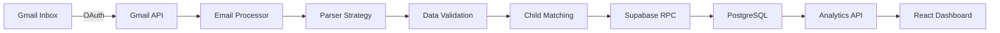

# 🌟 Overview
TinySteps is a comprehensive daycare tracking platform that automatically aggregates daily reports from multiple daycare providers, providing parents with beautiful analytics and insights about their child's development. Built with modern web technologies, it transforms fragmented email reports into a unified, actionable dashboard.
# ✨ Features
## 📧 Intelligent Email Processing

*   **Multi-Provider Support:** Automatically parses reports from various daycare systems
    *   Tadpoles integration
    *   Goddard Schools (via Tadpoles)
    *   Montessori schools (extensible framework)

*   **Smart Child Matching:** Intelligently matches reports to children using fuzzy name matching
*   **Duplicate Prevention:** Ensures each report is processed only once

## 📊 Comprehensive Analytics

*   **Sleep Tracking:** Visualize nap patterns and total sleep duration
*   **Meal Analytics:** Track eating habits and meal frequencies
*   **Activity Monitoring:** Understand your child's daily activities and development areas
*   **Photo Gallery:** Centralized collection of all daycare photos

## 👨‍👩‍👧 Family Features

*   **Multi-Child Support:** Track multiple children in one dashboard
*   **Family Sharing:** Invite caregivers to view reports
*   **Manual Entry:** Log events when automated reports aren't available

## 🔒 Security & Privacy

*   **Google OAuth:** Secure authentication via Google
*   **Row-Level Security:** Database-level access control
*   **Child Ownership Verification:** Ensures data privacy between families

# 🚀 Quick Start
## Prerequisites

*   Node.js 18+
*   Supabase account
*   Google Cloud Console project with OAuth 2.0 credentials
*   Gmail API access

## Installation

1.  Clone the repository
    ```bash
    git clone https://github.com/yourusername/tinysteps.git
    cd tinysteps
    ```

2.  Install dependencies
    ```bash
    yarn install
    # or
    npm install
    ```

3.  Set up environment variables
    ```bash
    cp .env.example .env.local
    ```

4.  Configure your `.env.local`
    ```env
    # Supabase Configuration
    NEXT_PUBLIC_SUPABASE_URL=your-supabase-url
    NEXT_PUBLIC_SUPABASE_ANON_KEY=your-anon-key
    SUPABASE_SERVICE_ROLE_KEY=your-service-role-key

    # Authentication
    NEXTAUTH_SECRET=your-secret-key
    NEXTAUTH_URL=http://localhost:3000

    # Google OAuth
    GOOGLE_CLIENT_ID=your-client-id
    GOOGLE_CLIENT_SECRET=your-client-secret

    # Optional Configuration
    GMAIL_FETCH_MAX_MESSAGES=10
    LOG_LEVEL=info
    ```

5.  Run database migrations
    ```bash
    npx supabase db push
    ```

6.  Start the development server
    ```bash
    yarn dev
    ```

Visit `http://localhost:3000` to see your app!
# 📁 Project Structure
```
tinysteps/
├── app/                    # Next.js 14 app router
│   ├── api/               # API routes
│   │   ├── gmail/         # Gmail integration endpoints
│   │   ├── analytics/     # Analytics data endpoints
│   │   └── children/      # Child management
│   ├── auth/              # Authentication pages
│   ├── settings/          # User settings & provider config
│   └── (routes)/          # Application pages
├── components/            # React components
│   ├── ui/               # shadcn/ui components
│   └── (features)/       # Feature-specific components
├── lib/                   # Core business logic
│   ├── gmail/            # Email parsing system
│   │   ├── parser.ts     # Parser implementations
│   │   └── processor.ts  # Email processing pipeline
│   ├── analytics/        # Data aggregation utilities
│   ├── supabase/         # Database client & types
│   └── auth/             # Authentication configuration
├── supabase/             # Database migrations & config
└── public/               # Static assets
```
# 🏗️ Architecture
## Technology Stack

*   **Frontend:** Next.js 14, React 18, TypeScript
*   **Styling:** Tailwind CSS, shadcn/ui
*   **Backend:** Next.js API Routes, Supabase
*   **Database:** PostgreSQL (via Supabase)
*   **Authentication:** NextAuth.js with Google OAuth
*   **Email Processing:** Gmail API, Cheerio HTML parsing
*   **Logging:** Pino with structured logging
*   **Testing:** Jest with comprehensive test suites

## Data Flow

# 🔧 Configuration
## Setting Up Daycare Providers

1.  Navigate to `Settings` → `Providers`
2.  Click `Add New Provider`
3.  Configure:
    *   **Provider Name:** Friendly name (e.g., "Bright Horizons Main St")
    *   **Sender Email:** Exact email address for reports
    *   **Parser Strategy (optional):** Select parsing method

### Available Parser Strategies
| Strategy            | Description                       | Email Pattern                     |
| :------------------ | :-------------------------------- | :-------------------------------- |
| `tadpoles_v1`       | Standard Tadpoles emails          | `*@tadpoles.com`                  |
| `goddard_tadpoles_v1` | Goddard schools using Tadpoles    | `*@tadpoles.com` + "Goddard"      |
| `montessori_v1`     | Direct Montessori emails          | Various                           |

# 📚 API Documentation
## Core Endpoints
### Gmail Integration
```typescript
GET /api/gmail/fetch
// Fetches and processes new daycare reports
// Returns: { processedCount, errors[] }
```
### Analytics
```typescript
GET /api/analytics/sleep?childId={id}&startDate={date}&endDate={date}
GET /api/analytics/meals?childId={id}&startDate={date}&endDate={date}
GET /api/analytics/activities?childId={id}&startDate={date}&endDate={date}
GET /api/analytics/photos?childId={id}&limit={n}&offset={n}
```
### Manual Logging
```typescript
POST /api/log
// Body: { type: 'nap'|'meal'|'bathroom'|'activity', childId, ...eventData }
```
## Database Schema
Key tables:

*   `children` - Child profiles
*   `daily_reports` - Parsed email reports
*   `naps`, `meals`, `bathroom_events`, `activities` - Event data
*   `photos` - Daycare photos
*   `user_daycare_providers` - Provider configurations

# 🧪 Testing
```bash
# Run all tests
yarn test

# Run with coverage
yarn test --coverage

# Run specific test suite
yarn test lib/gmail/parser.test.ts
```
# 🚢 Deployment
## Vercel Deployment

1.  Push to GitHub
2.  Import project in Vercel
3.  Configure environment variables
4.  Deploy!

## Production Checklist

*   Set `NODE_ENV=production`
*   Configure production Supabase instance
*   Set up proper Google OAuth redirect URIs
*   Enable Supabase RLS policies
*   Configure rate limiting for Gmail API
*   Set up monitoring and alerts

# 🤝 Contributing
We welcome contributions! Please see our [Contributing Guide](CONTRIBUTING.md) for details.

1.  Fork the repository
2.  Create your feature branch (`git checkout -b feature/amazing-feature`)
3.  Commit your changes (`git commit -m 'Add amazing feature'`)
4.  Push to the branch (`git push origin feature/amazing-feature`)
5.  Open a Pull Request

# 📈 Roadmap

*   **Mobile App:** React Native companion app
*   **Real-time Updates:** Push notifications for new reports
*   **Advanced Analytics:** ML-powered insights and predictions
*   **Provider Marketplace:** Community-contributed parser strategies
*   **Export Features:** PDF reports and CSV data exports
*   **Webhook Support:** Integration with other parenting apps
*   **Voice Assistant:** "Hey Google, how was Emma's day?"

# 📄 License
This project is licensed under the MIT License - see the [LICENSE](LICENSE) file for details.
# 🙏 Acknowledgments

*   [shadcn/ui](https://ui.shadcn.com/) for the beautiful component library
*   [Supabase](https://supabase.com/) for the incredible backend platform
*   [Next.js](https://nextjs.org/) team for the amazing framework
*   All the daycare providers who send daily reports to parents


<p align="center">
  Made with ❤️ by parents, for parents
</p>
<p align="center">
  <a href="https://tinysteps.app">Website</a> •
  <a href="https://docs.tinysteps.app">Documentation</a> •
  <a href="https://twitter.com/tinystepsapp">Twitter</a>
</p>
